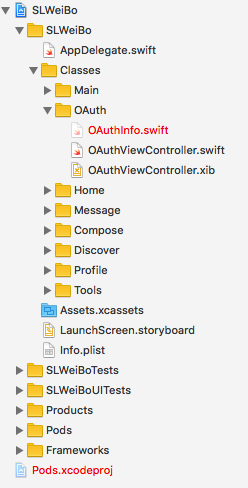
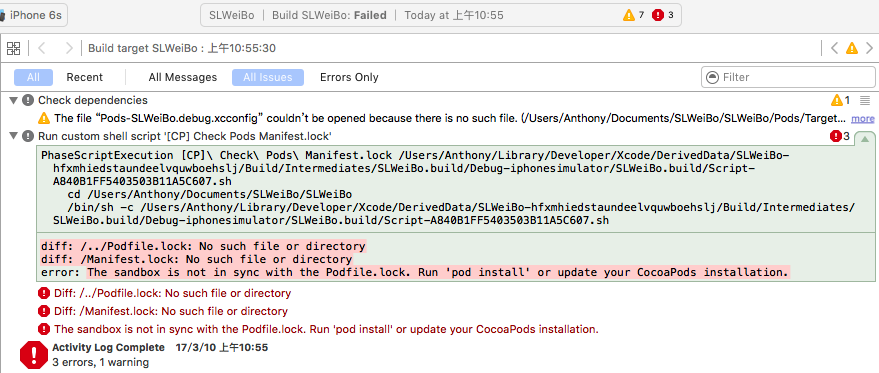

# SLWeiBo
## 高仿新浪微博

### git clone https://github.com/CoderSLZeng/SLWeiBo.git

clone项目之后

打开 SLWeiBo.xcworkspace之后会发现两个红色的文件


尝试编译或运行项目，出现下图



说明
* 1.缺少Pods文件
* 2.缺少OAuthInfo.swift文件

解决方法：

1.先执行更新pod文件

```
pod update --no-repo-update
```

2.编写微博API属于自己的授权信息文件“OAuthInfo.swift”添加到项目OAuth文件夹路径下

代码如下：

```
//  授权信息

import Foundation

// MARK: - 授权信息常量属性
/// App Key
let WB_App_Key = "<#输入自己账号的App Key#>"
/// App_Secret
let WB_App_Secret = "<#输入自己账号的App Secret#>"
/// 授权回调页
let WB_Redirect_URI = "<#输入自己账号的App回调地址#>"


let WB_APP_UserId = "<#输入自己微博账号#>"
let WB_APP_Passwd = "<#输入自己微博账号#>"
```

#### 授权接口请查看新浪微博API: 
#### http://open.weibo.com/wiki/Oauth2/authorize


